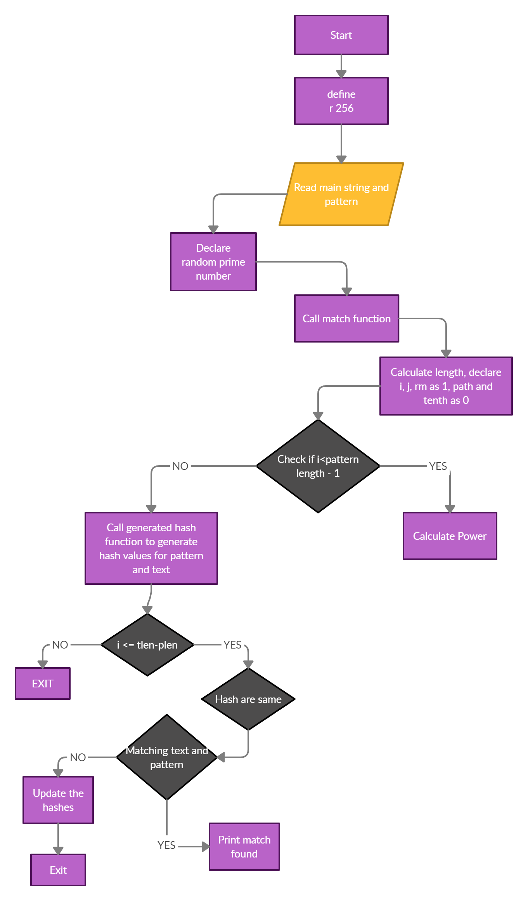
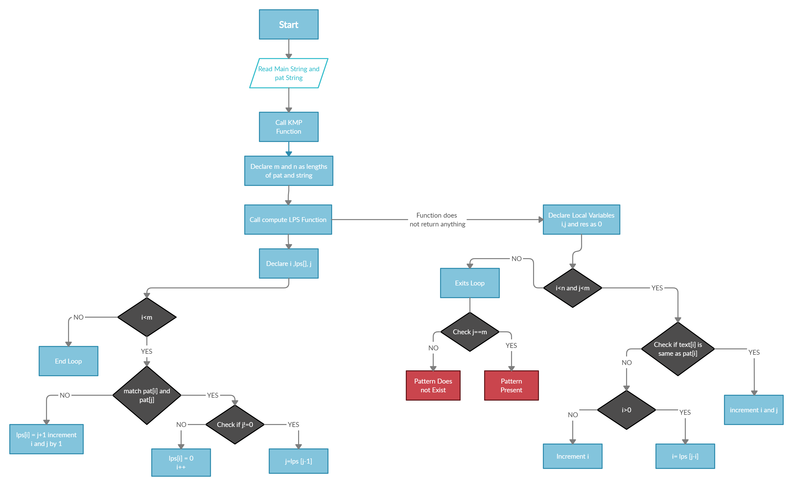
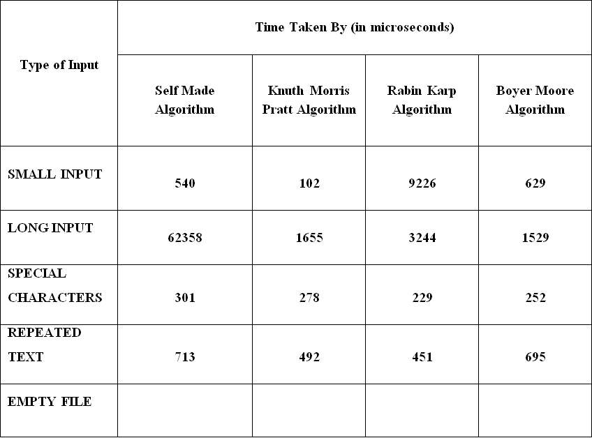
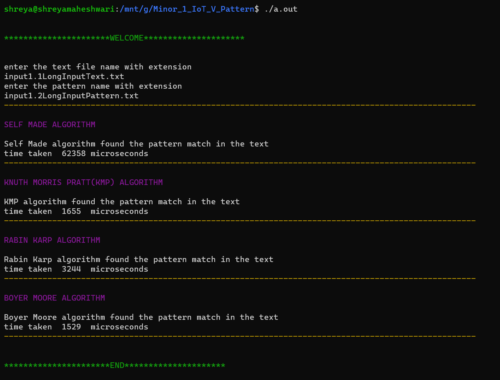
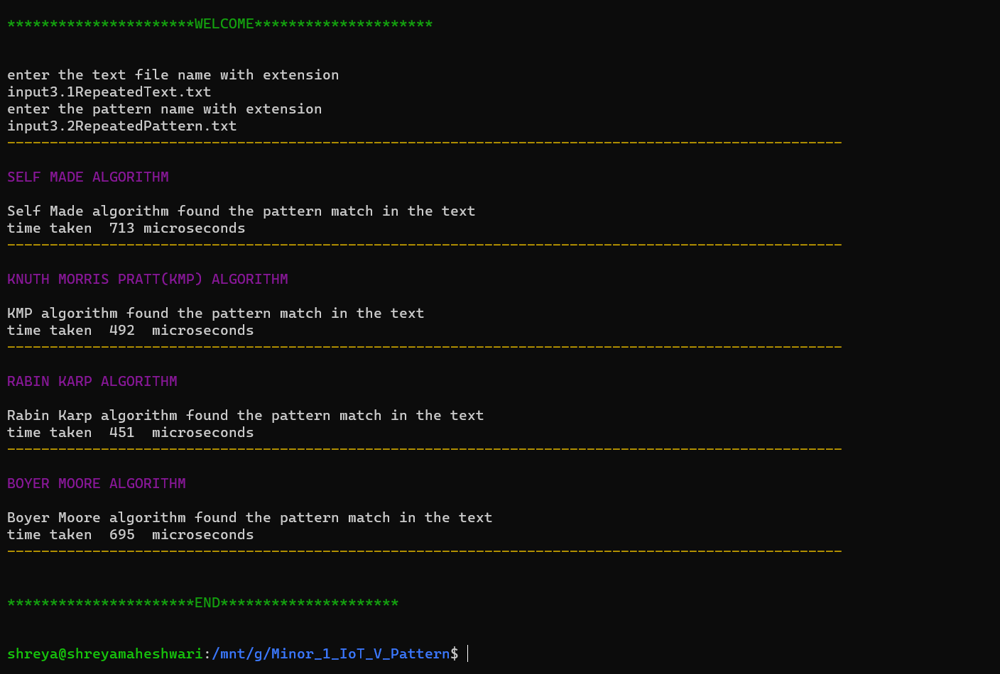
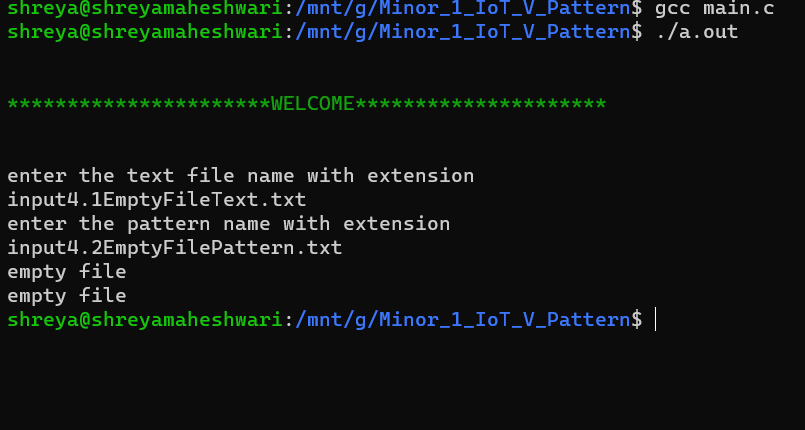
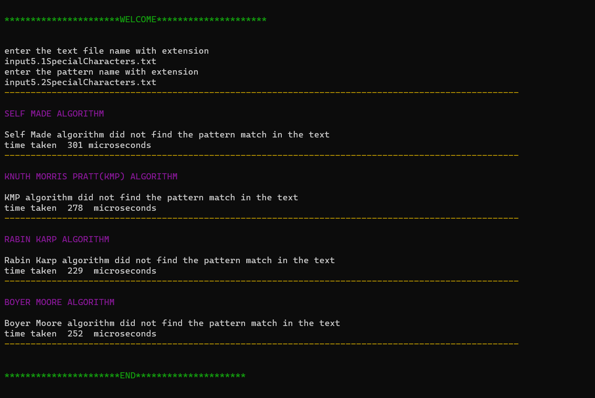

# <center>***“A COMPARATIVE STUDY OF STRING PATTERN MATCHING ALGORITHMS”***</center>

## <center>Introduction</center>

Data is a valuable asset that must be protected. Data is digital information transmitted through electrical signal It is divided into two types, writing, and sound. It may be manipulated or duplicated without the owner's knowledge. Plagiarism is an act of evil in the falsification of a work. It is done to increase the popularity of a plagiarist. With the advent of computer science technology, plagiarism can be avoided. Text mining is part of the science that discusses the processing of words.

Data Searching is a process which involves matching the data in a systematic order to make it easier to find, work and analyze. In computer science, string searching algorithms and also called string matching algorithms. String matching or searching algorithms search the pattern or alphabets from the array of elements. It is most required when you have data in bulk and we have to find a particular item amongst hundreds, thousands or more items.

Pattern Searching is a process of checking and finding a pattern from a string. Although there are huge numbers of searching algorithms available, but here our work intends to show an overview of comparison between three different types of searching algorithms. We have tried to cover some technical aspects of these three searching algorithms. This research provides a detailed study of how all the three algorithms work & give their performance analysis with respect to time complexity.

This is the way of making our study, research process easy and fast. Our project deals with comparative study about few Pattern Matching Algorithms. These algorithms check the possibility of presence of a sequence of characters from a particular string. If the sequence of characters in found in the string, pattern matching is performed. We work on the time consumed and the space occupied on searching a particular pattern from the data and searches the best result from the entire set of characters as fast and in the most convenient manner.

So our study shows the comparison of the different pattern matching algorithms.

Keywords: Data, Matching, Searching, Memory and Time Complexity, Hash codes, C.

  

## <center>Motivation of the Work</center>

  

We use searching so frequently while working on word or maybe power point or any other software. It's simply searching, but this simple search can be done in such effective way. Reading out about so many different algorithms only for searching makes us more eager to go in depth of it. These algorithms propose completely new ideas about how a simple search can be made. This gives us motivation to try and compare these algorithms and try building one of our own.

Objectives

This comparative study will help student to get the perfect idea of the algorithms they should use for different data projects. This study gives a clear view of the different functions of the pre existing algorithms with new updates. We also aim to lay a comparison between our generated algorithm and the previously compared algorithms.

Sub objective-

• This will help students to understand the searching algorithms and their best case scenarios.

  

## <center>Problem Statements</center>

  

There is numerous data which is analyzed and worked upon in every sector in the industry. Every time an item is to be searched an algorithm needs to be implemented to get the best results. A simple example is Google, its uses an algorithm to search for our searched item throughout its database matching the items and then showing us the output. It matches each word with the data and shows us any relevant data to it.

So this process needs to be as fast as possible for efficient searching.

• String matching is needed to search and retrieve items and important data from bulk of information which takes a lot of time if done manually.

• Working with large data and complex categories matching and searching, it becomes difficult and complex.

• Searching data becomes very time consuming and there is a need for better searching methods to make this task fast.

• Amongst all algorithms it’s important to compare and understand which algorithm is most suitable for the work.

• Best algorithm is one which takes the least time and space and gives the best output.

• String matching and searching can also be used for plagiarism check to match and compare the strings of Document 1 and Document 2.

When working with data in researches and studies, searching is a common method which helps to pick, update, delete and use data in an easier manner. Searching makes the study easy to understand and work on instead of going through all of it just to find one pattern or text. Working with patterns and matching of data also requires sorting. There are many ways to search data with different time and space complexities. Bases on these complexities and the following test cases we can decide the best algorithm for the data.

  

## <center>Literature Review</center>

Knuth, Morris and Pratt discovered first linear time string-matching algorithm by following a tight analysis of the naïve algorithm. Knuth-Morris-Pratt algorithm keeps the information that naïve approach wasted gathered during the scan of the text. The algorithm was conceived by James H. Morris and independently discovered by Donald Knuth "a few weeks later" from automata theory. Morris and Vaughan Pratt published a technical report in 1970. [1]  [2]

The Rabin Karp algorithm performs the matching by using hash function which was created by Richard M. Karp and Michael O. Rabin (1987). The Rabin–Karp algorithm is inferior for single pattern searching to Knuth–Morris–Pratt algorithm, Boyer–Moore string search algorithm. The hash function used here basically converts every string value into numeric value. [3]

Until now Boyer-Moore is considered as the most efficient algorithm for pattern matching. It was developed by Robert S. Boyer and J Strother Moore in 1977. This algorithm preprocesses the pattern that has to be searched in the string. There are two rules followed here. Two rules that are followed here are the good suffix rule and the bad character rule. [4]

  

## <center>Methodology</center>

  

### Rabin-Karp Algorithm:

Rabin Karp Algorithm works very similar to the brute force approach or the naive pattern matching algorithm, in which we traverse step by step while matching each character. Very similar to this is Rabin-Karp algorithm in which we once match the hash value of the substring if the hash value is matched then only we start with the matching of the characters individually. It algorithm uses hash functions and the rolling hash technique. A hash function is a function that maps the data of arbitrary size to fixed size values returning a values called hash values, hash codes, digests or hashes.

In this algorithm there is only one comparison taking place per text subsequence. The character searching and matching is done only when the hash values for the sequences match.

Steps for Rabin-Karp algorithm:

1. Find the hash function for the pattern for item.

2. Find the hash for sub patterns or string of the item (pattern length) .

3. Match and search the substring/pattern of text and its pattern from the block of data. Search the item if the hash of the sub pattern is equal to the pattern’s hash.

  

## <center> Algorithm</center>

```

STEP 1. function call

STEP 2. declare text string to store the main text

STEP 3. declare pat string to store the pattern to be searched

STEP 4. declare a variable q as a random prime number

STEP 5. call to the function match(pass pattern, text, q) from 6 to 30

STEP 5.1 calculate the length of pat and text and store them as plen and tlen

STEP 5.2 declare variables i and j

STEP 5.3 declare variable rm as 1

STEP 5.4 declare two variables to store hash of pattern and text i.e. pat_h and text_h

STEP 5.5 for i=0 to i<plen-1 do from 11 to

STEP 5.6 calculate rm = (rm * r) mod q

STEP 5.7 pat_h = generate_hash function call

STEP 5.8 text_h = generate_hash function call

STEP 5.8.1 generate_hash( string, length, prime number)

STEP 5.8.2 declare a variable h = 1

STEP 5.8.3 declare int variable i for loop

STEP 5.8.4 for i=0 to i< length increment i by 1 do 18

STEP 5.8.5 calculate the hash value as h = (h * r + string[i]) mod q

STEP 5.8.6 return h

STEP 6 for i = 0 to i <= tlen - plen do 21 till 26

STEP 7 check if pat_h is same as text_h

STEP 8 if same do for j = 0 to plen increment j by 1 from 23

STEP 9 if(text[i+j] != pat[j])

STEP 10 then break the loop

STEP 11 if( j is equal to plen)

STEP 12 print match found

STEP 13 check if i < tlen-plen

STEP 14 r is defined as a constant 256, check if so then change the value of text_h as

(r * (text_h - text[i] * rm) + text[i + plen]) mod q

STEP 15 check if (text_h < 0) then

STEP 16 make it positive by adding q

STEP 17 End Function

  

```

  

##  <center>Knuth Morris Pratt Algorithm</center>

Knuth Morris Pratt Algorithm is based on the concept of generating a suffix-prefix table also known as the Pi table or the lps table. The pi table is generated using the substring (this is the pre-processing part). The way to generate the substring is the main part in this algorithm. The main concept behind this approach is we save the pattern. As soon as we detect the mismatch while searching for the pattern we already know a part of the pattern in the next window.

  

###  <center>Algorithm</center>

  

```

STEP 1. function call

STEP 2. declare text and pattern

STEP 3. function call kmp_search(pass text and pattern)

STEP 3.1 void kmp_search(refernce to the pattern, reference tothe text) from 5 to

STEP 3.2 length of pattern -> m

STEP 3.3 length of text -> n

STEP 3.4 declare an array to store the lps table

STEP 3.5 function call to computeLPS(pass pattern, length of pattern, pass lps table)

STEP 3.5.1 void computeLPS(pattern, length of pattern, lps table)

STEP 3.5.1.1 call the function computeLPS (pattern, m, lps)

STEP 3.5.1.2 declare a variable i = 1, j=0 and first value of lps table as 0

STEP 3.5.1.3 while i < m execute from steps 13 to

STEP 3.5.1.4 check if pat[i] is equal to pat[j]

STEP 3.5.1.5 check if j is not equal to 0 then

STEP 3.5.1.6 assign j as lps[j-1]

STEP 3.5.1.7 else assign lps[i] as 0 and increment i by 1

STEP 3.5.2 declare i = 0 , j = 0 , res = 0

STEP 3.5.3 while i < n and j<m execute from step 12 to 17

STEP 3.5.3.1 check if the ith valur of text is same as jth value of pattern

STEP 3.5.3.2 increment both i and j

STEP 3.5.3.3 else

STEP 3.5.3.4 check if j > 0

STEP 3.5.3.5 if the condition is true then assign j as lps[j-1];

STEP 3.5.3.6 else increment i by 1

STEP 3.5.4 check if j is equal to m

STEP 3.5.5 print pattern present

STEP 3.5.6 else

STEP 3.5.7 print pattern not present

STEP 4 End Function

```

## <center>Boyer-Moore Algorithm</center>

  

Boyer-Moore Algorithm unlike the other two algorithm starts matching from the last character of the pattern. In this algorithm we create two approaches , the bad character heuristic and the good suffix heuristic. In this approach we shift the character which is initially in the mismatch state and bring it to a position where a match is found. Upon comparing the last character of the pattern if the match is not found the entire pattern is shifted by the length of the pattern.[5]

### <center>Algorithm</center>

```

STEP 1. Start Function

STEP 2. search function call

STEP 2.1 declare m and n as lengths of pattern and text

STEP 2.2 dynamic memeory allocation for array tab

STEP 2.3 call to the table function

STEP 2.3.1 assign the tab initially as -1

STEP 2.3.2 assign the tab as pattern

STEP 2.4 declare s and flag with value 0

STEP 2.5 while s <=(n - m) do from 2.6 to 2.13

STEP 2.6 declare j as m-1

STEP 2.7 while j >= 0 and pat[i] == txt[s+j] do j--

STEP 2.8 if j < 0 then do from 2.9 to 2.11

STEP 2.9 flag++

STEP 2.10 return true

STEP 2.11 s += (s+m < n)? m-tab[txt[s+m]]

STEP 2.12 else do s+ = max(1, j-tab[txt[s+j]])

STEP 2.13 end while

STEP 2.14 check if flag == 0 return false

STEP 3 End Function

  

```

  

## <center>Self Designed Algorithm:</center>

  

### <center>Algorithm</center>

  

```

STEP 1. passing the main string and the pattern

STEP 2. calling the calculate function

STEP 2.1 creating two pointers one at the start and another at the last of text - length of the pattern.

STEP 2.2 matching the values from the beginning and the starting

STEP 2.3 terminating at the midpoint when the first pointer crosses the secind pointer

STEP 2.4 if match found then print match found from

(beginning / last)

STEP 2.5 else print match not found

STEP 3. End Function

```

# <center>Implementation:</center>

## <center>Flow Charts</center>

## <center>Rabin-Karp Algorithm</center>



The above given flow chart describes the working of Rabin Karp Algorithm. This is primarily based on hashing! The steps shows us the work flow, initially we take the pattern and the same length of the pattern as text and generate there hash values. We then match the hash values. If the hashes for the two match we start the comparison of the characters one by one. If all the characters are matched we print the result as match found else we move to the next character and continue the process.

  

## <center>Knuth Morris Pratt Algorithm</center>

  



The above shown flow chart diagram describes the working of the Knuth Morris Pratt Algorithm. The steps proceed with the generation of the lps table. In the entire flow of the sequence we are creating the lps table to store the previous occurance of characters lf we find the occurance of the characters again in the text we directly start the matching from the point we last found the sequence in the table.

Boyer Moore Algorithm


  

In this procedure, the substring or pattern is searched from the last character of the pattern. When a substring of main string matches with a substring of the pattern, it moves to find other occurrences of the matched substring. It can also move to find a prefix of the pattern which is a suffix of main string. Executing the executeBoyer Moore Function and creating the table for the text then searching for the pattern in the file.

# <center>Data Flow Diagram</center>


  

# <center>Result and Discussions</center>

The Comparative Study of the Pattern Matching Algorithms on analyzing all the Algorithms with different types of input. This a comparison table for the different time taken by the algorithm The result is as shown in the table below:

  



# <center>The outputs of the programs are given below:- </center>








  



  

## <center>References</center>

  

[1] "Wikipedia," [Online]. Available: https://en.wikipedia.org/wiki/Rabin%E2%80%93Karp_algorithm. [Accessed 20 11 2020].

[2] R. Sedgewick, "Coursera.org," [Online]. Available: https://www.coursera.org/lecture/algorithms-part2/rabin-karp-3KiqT. [Accessed 18 11 2020].

[3] "Personal.kent.edu," [Online]. Available: http://www.personal.kent.edu/~rmuhamma/Algorithms/MyAlgorithms/StringMatch/kuthMP.htm. [Accessed 20 11 2020].

[4] "Wikipedia," [Online]. Available: https://en.wikipedia.org/wiki/Knuth%E2%80%93Morris%E2%80%93Pratt_algorithm. [Accessed 20 11 2020].

[5] "Wikipedia," 18 11 2020. [Online]. Available: https://en.wikipedia.org/wiki/Boyer%E2%80%93Moore_string-search_algorithm#:~:text=In%20computer%20science%2C%20the%20Boyer,J%20Strother%20Moore%20in%201977. [Accessed 20 11 2020].

[6] "Personal.kent.edu," [Online]. Available: https://www.personal.kent.edu/~rmuhamma/Algorithms/MyAlgorithms/StringMatch/kuthMP.htm. [Accessed 20 11 2020].

  

# <center>Appendix 1: Codes </center>

### <center>Knuth Morris Pratt Algorithm</center> 

[Click to open the KMP code](/KMP/kmp.c)

###  <center>Rabin Karp Algorithm</center>

[Click to open the Rabin Karp Algorithm code](/Rabin_Karp/RabinKarp.c)

### <center>Boyer Moore Algorithm</center>

[Click to open the Boyer Moore Algorithm code](/Boyer-Moore/Boyer_Moore.c)

### <center>Self Designed Algorithm</center>

[Click to open the Self Designed Algorithm code](/SelfMade/SelfMade.c)